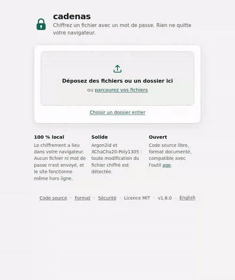

# cadenas

[English](README.md) · **Français**

> Chiffrez un fichier avec un mot de passe, simplement.

[](https://github.com/PierreEbele/cadenas/actions/workflows/ci.yml)
[](https://www.npmjs.com/package/cadenas)
[](https://scorecard.dev/viewer/?uri=github.com/PierreEbele/cadenas)
[](https://www.bestpractices.dev/projects/14992)
[](LICENSE)

**cadenas** chiffre et déchiffre un fichier avec un mot de passe, **directement dans votre
navigateur** : aucun fichier ni mot de passe n'est envoyé sur Internet. Le même outil
existe en ligne de commande.

<p align="center">
  <a href="https://getcadenas.com/"><strong>Essayer maintenant</strong></a> ·
  <a href="#ligne-de-commande">Ligne de commande</a> ·
  <a href="#héberger-soi-même-avec-docker">Docker</a> ·
  <a href="docs/FORMAT.fr.md">Format</a>
</p>

<p align="center">
  <a href="https://getcadenas.com/">
    
  </a>
</p>

- **Simple** : déposez un fichier, choisissez un mot de passe, téléchargez le résultat.
- **Local** : tout se passe sur votre appareil. La page n'a techniquement pas le droit
  d'ouvrir une connexion réseau (Content Security Policy `connect-src 'none'`).
- **Solide** : Argon2id et XChaCha20-Poly1305 ; toute modification du fichier chiffré est détectée.
- **Ouvert** : code libre, [format documenté](docs/FORMAT.fr.md), compatible avec
  [age](https://age-encryption.org).
- **Partout** : site (fonctionne hors ligne, installable), ligne de commande
  pour Windows, macOS et Linux, image Docker, bibliothèque JavaScript.

## Sommaire

- [Pourquoi cadenas ?](#pourquoi-cadenas-)
- [Utiliser le site](#utiliser-le-site)
- [Héberger soi-même avec Docker](#héberger-soi-même-avec-docker)
- [Ligne de commande](#ligne-de-commande)
- [Formats `.cadenas` et `.age`](#formats-cadenas-et-age)
- [Sécurité](#sécurité)
- [Utiliser cadenas comme bibliothèque](#utiliser-cadenas-comme-bibliothèque)
- [Questions fréquentes](#questions-fréquentes)
- [Développement](#développement)

## Pourquoi cadenas ?

Vous voulez envoyer un document sensible par e-mail, stocker une sauvegarde
dans le cloud ou garder un fichier sur une clé USB, et il vous faut juste un
mot de passe dessus. Les outils existants sont soit en ligne de commande, soit
à installer, soit conçus pour autre chose (archives, disques chiffrés).
cadenas fait une seule chose : **un fichier, un mot de passe, depuis n'importe
quel appareil muni d'un navigateur**.

| | **cadenas** | [age](https://age-encryption.org) | [7-Zip](https://www.7-zip.org) | [VeraCrypt](https://www.veracrypt.fr) |
|---|:---:|:---:|:---:|:---:|
| Fonctionne dans le navigateur, rien à installer | ✅ | ❌ | ❌ | ❌ |
| Fonctionne sur téléphone (iOS, Android) | ✅ | ❌ | ❌ | ❌ |
| Interface graphique | ✅ | ❌ | ✅ | ✅ |
| Ligne de commande | ✅ | ✅ | ✅ | ✅ |
| Chiffre un simple fichier (pas de volume à monter) | ✅ | ✅ | ✅ | ❌ |
| Chiffrement authentifié : toute modification est détectée | ✅ | ✅ | ❌ <sup>1</sup> | ❌ <sup>2</sup> |
| Dérivation du mot de passe gourmande en mémoire (freine les attaques sur GPU) | ✅ Argon2id | ✅ scrypt | ❌ <sup>3</sup> | — |
| Lit et écrit les fichiers age | ✅ | ✅ | ❌ | ❌ |
| Version web auto-hébergeable (Docker) | ✅ | ❌ | ❌ | ❌ |
| Libre et open source | ✅ | ✅ | ✅ | ✅ |
| Audit de sécurité indépendant | ❌ [pas encore](docs/AUDIT.fr.md) | — | — | ✅ <sup>4</sup> |

<sup>1</sup> Les archives 7z vérifient un CRC des données déchiffrées, pas une étiquette cryptographique.<br>
<sup>2</sup> Les volumes VeraCrypt utilisent le mode XTS, qui ne détecte pas les modifications.<br>
<sup>3</sup> 7-Zip dérive la clé par SHA-256 itéré.<br>
<sup>4</sup> Audité par Quarkslab en 2016.<br>
— : dépend de la version, ou non vérifié par nous.

**Prenez plutôt un autre outil** si vous voulez du chiffrement par clé
publique ([age](https://age-encryption.org)), un disque entier chiffré ou des
volumes cachés ([VeraCrypt](https://www.veracrypt.fr)), ou avant tout des
archives compressées ([7-Zip](https://www.7-zip.org)).

## Utiliser le site

Version en ligne : **<https://getcadenas.com/>**

1. Déposez un fichier, plusieurs fichiers ou un dossier entier (ils sont alors
   réunis dans une archive `.zip` chiffrée).
2. Saisissez un mot de passe.
3. Téléchargez le résultat.

cadenas reconnaît tout seul si le fichier est à chiffrer ou à déchiffrer. Le site
est disponible en français et en anglais, selon la langue du navigateur.

Après une première visite, **le site fonctionne hors ligne** et peut s'installer
comme une application (menu du navigateur → « Installer cadenas » ou « Ajouter à
l'écran d'accueil »). Les résultats de plus de 256 Mio ne sont jamais gardés en
mémoire : Chrome et Edge les écrivent directement sur le disque, Firefox et
Safari les téléchargent au fur et à mesure. Une fois installé sur Chrome ou Edge,
cadenas apparaît aussi dans « Ouvrir avec » pour les fichiers `.cadenas` et
`.age`.

## Héberger soi-même avec Docker

L'image ne contient qu'un petit serveur nginx qui distribue la page. Le chiffrement
reste dans le navigateur de chaque visiteur : votre serveur ne voit jamais ni les
fichiers ni les mots de passe.

```bash
docker run -d -p 8080:8080 --name cadenas ghcr.io/pierreebele/cadenas
```

Le site est alors disponible sur <http://localhost:8080>.

Avec Docker Compose, en utilisant le [`compose.yaml`](compose.yaml) du dépôt, qui
lance le conteneur en lecture seule et sans privilèges :

```bash
docker compose up -d
```

L'image est publiée pour `linux/amd64` et `linux/arm64` (Raspberry Pi, NAS…).
Elle fonctionne sans droits root et envoie des en-têtes de sécurité stricts
(voir [`docker/security-headers.conf`](docker/security-headers.conf)).
Pour la construire vous-même : `docker build -t cadenas .`

> Servez le site en **HTTPS** si vous l'exposez au-delà de votre réseau local
> (par exemple derrière Caddy, Traefik ou nginx), sinon la page pourrait être
> modifiée en chemin.

## Ligne de commande

**Avec Homebrew** (macOS, Linux) :

```bash
brew install pierreebele/cadenas/cadenas
```

**Avec Node.js** (22 ou plus récent) :

```bash
npm install -g cadenas
```

Ou sans installation, avec `npx cadenas lock rapport.pdf`.

**Sans Node.js** : téléchargez l'exécutable de votre système dans la
[dernière release](https://github.com/PierreEbele/cadenas/releases/latest)
(`cadenas-vX.Y.Z-windows-x64.exe`, `-macos-arm64`, `-linux-x64`, `-linux-arm64`),
renommez-le `cadenas` et placez-le dans votre `PATH`. Ces fichiers ne sont pas signés
par un éditeur reconnu : Windows peut afficher un avertissement SmartScreen
(« Informations complémentaires » → « Exécuter quand même »), et sous macOS il faut
retirer la quarantaine avec `xattr -d com.apple.quarantine cadenas`. Vous pouvez
vérifier qu'un exécutable a bien été construit par ce dépôt :
`gh attestation verify cadenas-vX.Y.Z-linux-x64 --repo PierreEbele/cadenas`.

```bash
cadenas lock rapport.pdf              # → rapport.pdf.cadenas
cadenas unlock rapport.pdf.cadenas    # → rapport.pdf
cadenas verify rapport.pdf.cadenas    # vérifie le fichier et le mot de passe, sans rien écrire
cadenas lock photos/                  # → photos.zip.cadenas (tout le dossier)
cadenas lock a.pdf b.pdf              # → cadenas-AAAA-MM-JJ.zip.cadenas
cadenas lock --age rapport.pdf        # → rapport.pdf.age, lisible par age / rage
cadenas lock --hide-name rapport.pdf  # → cadenas-AAAA-MM-JJ.zip.cadenas (nom gardé à l'intérieur)
cadenas passphrase                    # → phrase de passe aléatoire de 5 mots
```

Plusieurs fichiers ou des dossiers sont réunis dans une archive `.zip` avant
d'être chiffrés ; une fois déchiffrée, elle s'ouvre avec n'importe quel outil.

`-` désigne l'entrée ou la sortie standard, pour les scripts et les sauvegardes :

```bash
tar c projet | cadenas lock - --password-file ~/.cle > projet.tar.cadenas
cadenas unlock projet.tar.cadenas -o - --password-file ~/.cle | tar x
```

| Option | Rôle |
|---|---|
| `-o, --output <chemin>` | fichier de sortie (`-` : sortie standard) |
| `-f, --force` | écrase le fichier de sortie s'il existe |
| `--age` | chiffre au format age (avec `lock`) |
| `--password-file <fichier>` | lit le mot de passe dans un fichier (première ligne) |
| `--password-stdin` | lit le mot de passe sur l'entrée standard |
| `-h, --help` / `-v, --version` | aide / version |
| `-w, --words <n>` | nombre de mots de `passphrase` (5 par défaut) |
| `--lang <fr\|en>` | langue des mots de `passphrase` (fr par défaut) |

Le mot de passe est demandé sans écho (deux fois pour chiffrer), directement dans
le terminal même quand les données arrivent par l'entrée standard. Vers un
fichier, une erreur (mauvais mot de passe, fichier altéré) ne laisse jamais de
fichier partiel ; vers la sortie standard, le code de sortie non nul signale que
les données sont incomplètes. Les messages vont sur la sortie d'erreur, jamais
dans les données. Ils sont en français ou en anglais, selon la langue du système
(`LANG=en_US.UTF-8` pour l'anglais).

Codes de sortie : `0` succès, `1` erreur, `2` mauvaise utilisation, `130` annulation.

## Formats `.cadenas` et `.age`

| | `.cadenas` (par défaut) | `.age` |
|---|---|---|
| Dérivation du mot de passe | Argon2id (64 Mio, 3 passes) | scrypt (2¹⁸) |
| Chiffrement | XChaCha20-Poly1305, blocs de 64 Kio | ChaCha20-Poly1305, blocs de 64 Kio |
| Lisible par | cadenas | cadenas, [age](https://github.com/FiloSottile/age), [rage](https://github.com/str4d/rage) |
| Audit indépendant | non | le format age est largement relu et utilisé |

Au déchiffrement, le format est détecté automatiquement. cadenas lit aussi les
fichiers age « armurés » (`age -a`). Les fichiers age chiffrés pour une clé publique
(et non un mot de passe) ne sont pas pris en charge.

Spécification complète du format `.cadenas` : [docs/FORMAT.fr.md](docs/FORMAT.fr.md).

## Sécurité

- Choisissez un mot de passe long : une phrase de 4 ou 5 mots aléatoires est facile
  à retenir et très solide. Le bouton « Générer une phrase de passe » du site (ou
  `cadenas passphrase`) en tire une au hasard : 5 mots, plus de 64 bits d'entropie.
- **Un mot de passe oublié ne peut pas être récupéré.**
- Le nom du fichier et sa taille approximative restent visibles.
- Le format `.cadenas` n'a pas encore été audité par des spécialistes indépendants.

Détails et signalement de vulnérabilités : [SECURITY.fr.md](SECURITY.fr.md).

## Utiliser cadenas comme bibliothèque

`npm install cadenas`. Le cœur fonctionne à l'identique dans Node.js et dans les
navigateurs, avec l'API Web Streams :

```js
import { encrypt, decrypt, readAll, streamFromBytes } from 'cadenas';

const sealed = await readAll(await encrypt(streamFromBytes(data), 'mot de passe'));
const { format, stream } = await decrypt(streamFromBytes(sealed), 'mot de passe');
const plain = await readAll(stream);
```

`encrypt(flux, motDePasse, { format: 'age' })` produit un fichier age. Les erreurs
sont des `CadenasError` avec un `code` stable (`WRONG_PASSWORD`, `CORRUPTED`,
`TRUNCATED`, `UNKNOWN_FORMAT`…), documentés dans [`src/errors.js`](src/errors.js).

## Questions fréquentes

**Chiffrer des fichiers sur un site web, vraiment ?**
La page est un fichier statique : une fois chargée, sa propre politique de
sécurité du contenu (`connect-src 'none'`) lui interdit d'ouvrir la moindre
connexion réseau. Elle ne pourrait pas envoyer votre fichier même si elle
essayait. Des tests automatiques le vérifient dans Chromium, Firefox et WebKit
à chaque modification. Vous pouvez aussi l'utiliser hors ligne, l'héberger
vous-même avec Docker, ou passer par la ligne de commande.

**Comment vérifier que rien n'est envoyé ?**
Ouvrez les outils de développement du navigateur, onglet Réseau, puis
chiffrez un fichier : aucune requête ne part ailleurs qu'à l'adresse du site
(la page charge seulement ses propres scripts). Ou coupez Internet après la
première visite : le site continue de fonctionner.

**Et si cadenas disparaît un jour ?**
Vos fichiers restent lisibles. Le format `.cadenas` est [entièrement
spécifié](docs/FORMAT.fr.md) et n'utilise que des primitives standard, et le
format `.age` se déchiffre avec [age](https://github.com/FiloSottile/age) ou
[rage](https://github.com/str4d/rage), sans cadenas.

**J'ai oublié mon mot de passe. Pouvez-vous m'aider ?**
Non, et personne ne le peut : il n'y a ni porte dérobée ni récupération.
Utilisez le bouton « Générer une phrase de passe » et notez-la en lieu sûr.

**La personne à qui j'envoie le fichier pourra-t-elle l'ouvrir ?**
Oui, si elle connaît le mot de passe : elle ouvre le même site, dépose le
fichier et tape le mot de passe. Sans compte ni installation.

**Quelle taille de fichier au maximum ?**
Pas de limite fixe : les fichiers sont traités par blocs de 64 Kio. Dans
Chrome, Edge, Firefox et Safari, les résultats de plus de 256 Mio sont écrits
sur le disque au fur et à mesure au lieu d'être gardés en mémoire. La ligne de
commande traite tout en flux.

## Développement

```bash
npm install
npm run dev      # site en local avec rechargement automatique
npm test         # tests (node:test)
npm run lint     # vérification du code (ESLint)
npm run build    # site statique dans dist/
```

Organisation :

```
src/        cœur partagé (formats, détection, noms de fichiers)
web/        site (page, styles, worker de chiffrement)
bin/        ligne de commande
docker/     configuration nginx de l'image
docs/       format, architecture, argumentaire de sécurité
test/       tests, vecteur de test, implémentation de référence
```

Les contributions sont les bienvenues, en français ou en anglais : voir
[CONTRIBUTING.fr.md](CONTRIBUTING.fr.md). Chaque document existe en anglais (par défaut) et en
français (fichiers `.fr.md`).

- Architecture : [docs/ARCHITECTURE.fr.md](docs/ARCHITECTURE.fr.md)
- Feuille de route : [ROADMAP.fr.md](ROADMAP.fr.md)
- Gouvernance : [GOVERNANCE.fr.md](GOVERNANCE.fr.md)
- Politique de signature de code : [docs/CODE_SIGNING.fr.md](docs/CODE_SIGNING.fr.md)
- Code de conduite : [CODE_OF_CONDUCT.fr.md](CODE_OF_CONDUCT.fr.md)
- Historique des versions : [CHANGELOG.fr.md](CHANGELOG.fr.md)

## Licence

[MIT](LICENSE) © Pierre Ebele

Listes de mots du générateur de phrases de passe :

- français : liste de Tango pour [Tails](https://tails.net), domaine public (CC0 1.0) ;
- anglais : [EFF Large Wordlist](https://www.eff.org/dice) de l'Electronic Frontier
  Foundation, sous licence [CC BY 3.0 US](https://creativecommons.org/licenses/by/3.0/us/).
